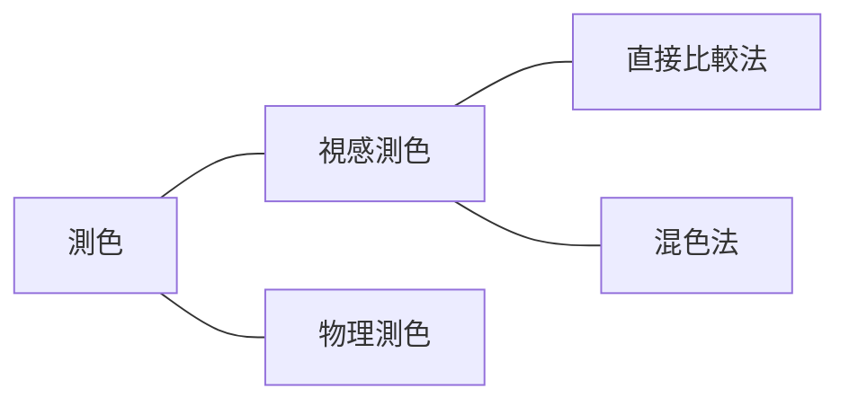

# 記事 記法ガイド

次の3種類の解説記事の本文（`+page.svx`）を書くときに従う、記法・書式のガイドです。

- **CG・画像処理**（`app/src/routes/cg/**/<slug>/+page.svx`）
- **色の理論**（`app/src/routes/color-theory/<slug>/+page.svx`）
- **色の活用分野**（`app/src/routes/color-fields/<slug>/+page.svx`）

記事の種類によって異なるのは**大見出しに付ける「分類タグ」**だけで、それ以外のディレクティブ・数式・コードの記法は3種類すべてで共通です。

このガイドが扱うのは「どの記法で書くか」だけです。何を書くか・どう語るか（構成・語り口・推敲）は、`thinking-flow.md`（思考フロー）・`writing-style.md`（文章構成）・`stylistic-quirks.md`（表現上の癖）・`refine-style.md`（推敲・修正傾向）を参照してください。

**数式（KaTeX）の記法と、その表記に関わるインラインコードの規約（数字のインラインコード化・前後の空白）は `math-notation-guide.md` に切り出してあります。** 記事本文を書くときは、このガイドと合わせて両方に従ってください。

---

## 記事の骨格

- `# 見出し`（H1）は使わない。H1はフロントマターの `title` から自動生成されます。
- 本文は**いきなり最初の見出し（`##`）から始めない**。見出しの付かない導入文（リード）を置きます。導入文は**リスト・箇条書き・ディレクティブを使わず、段落（文章）だけ**で構成します（分量・テイストの判断は `writing-style.md`「導入」を参照）。
- 記事は `##`（大見出し＝節）と `###`（中見出し＝小節）で構成します。`####` はほとんど使いません。
- すべての `##` には分類タグディレクティブを付けます（→「見出しの分類タグ」）。`###` は常にプレーンテキストです（例: `### 等色式`）。

## ディレクティブ

このプロジェクトの `.svx`（mdsvex）は、通常のMarkdownに加えて独自のディレクティブを使います。使える名前は `app/svelte.config.js` の `directives` に登録され、実体は `app/src/lib/components/m-directive/` のSvelteコンポーネントです。本文中で意味のある要素は、素のMarkdownではなく次のディレクティブで表現してください。

ディレクティブには3つの形があります。

| 形 | 記法 | 例 |
| --- | --- | --- |
| テキスト（地の文に埋める） | `:Name[本文]{属性}` | `:Anki[画素]` |
| リーフ（単独の1行） | `::Name{属性}` | `::ComingSoon` |
| コンテナ（ブロック） | `:::Name{属性}` 〜 `:::` | `:::Note` 〜 `:::` |

属性は `{key="値"}` の形で書きます。値を持たない真偽値の属性は `{lastWide}` のようにキーだけを置きます。

### ルール1: 重要な単語は `:Anki[]` で囲む

その記事で**定義される専門用語**や、**読者に覚えてほしいキーワード**は `:Anki[...]` で囲みます。

```
区画化された画素の最小単位を:Anki[画素]といいます。
```

`:Anki[]` で囲んだ語は、通常表示では強調されますが、**暗記モード（anki mode）では隠されます**。つまり記事は、暗記モードで**穴埋め問題集**として機能します。この性質を前提に、次のルールを守ってください。

- **隠れても文脈から答えを復元できる語にだけ付ける**。穴埋めとして成立しない（前後の文脈から思い出せない）語に付けてはいけません。
- **乱用しない**。1文・1段落に空欄が多すぎると、空欄どうしが依存し合って解けなくなります。「その文・その節の主役になる、覚える価値のある語」だけに絞ります。普通名詞・接続表現・自明な語には付けません。
- **同じ語を複数回囲んでよい**。初出だけに限る必要はありません。節をまたいで再登場する語、まとめ・対比・箇条書きでの反復言及など、その箇所でも主役になる語なら付けます（判断基準は上の2点、「隠れても答えられるか」「その文・その節の主役か」です）。
- 用語を「〜といいます」「〜と呼ばれます」と定義する文では、定義される語を `:Anki[]` で囲むのが基本パターンです。
- 英略語などは、読み下しと略語の両方を囲んでよい（例: `:Anki[標本化]`、`:Anki[AD変換]`）。
- **すでに設定されている `:Anki[]` を勝手に外さない**。既存記事を編集するときは、すでに付いている `:Anki[]` を（明示的な指示がない限り）そのまま残します。

#### `:Mark[]` — 暗記モードで隠れない強調（執筆時には使わない）

`:Mark[...]` は `:Anki[]` と同じ見た目で強調しますが、**暗記モードでも隠れません**。穴埋めにはせず強調だけしたい語のためのディレクティブです。

**執筆・推敲・編集では `:Mark[]` を使ってはいけません。** 強調はすべて `:Anki[]` で表現します。どの語を「隠さない強調」にするかは著者（人間）が判断する領域なので、AIの側から `:Mark[]` を選ぶことはしません。

- 新しく強調を付けるときは、必ず `:Anki[]` を使います。
- **すでに `:Mark[]` が付いている語は、`:Anki[]` に変えずそのまま残します**（著者が意図して選んだものです）。`:Anki[]` を勝手に外さないのと同じ扱いで、囲む語も範囲も保持します。
- ユーザーから明示的に「ここは `:Mark[]` にする」と指示された場合だけ、`:Mark[]` を書きます。

#### `:Anki[]` と インラインコード `` `code` `` の使い分け

- `:Anki[]` … 概念・用語そのもの（読者に印象づけたいキーワード）。
- `` `code` `` … 記号・値・表記そのものを**リテラルとして引用**するとき（色コード・座標・数値表記など）。

```
色相が`2`（赤）で、トーンが`v`（vivid）の色は:Anki[v2]と表します。
```

`:Anki[]` の中ではインラインコードを使えないため、両方に当てはまる表記（上の例の `v2`）は `:Anki[]` を優先し、バッククォートで囲みません。

**数字を必ずインラインコードにするルールと、インラインコードの前後に空白を置かないルールは `math-notation-guide.md` にあります。**

### ルール2: 流れに乗せづらい補足情報は `:::Note` に書く

本筋の説明には含めたいが、文章の流れを止めてしまう**補足・脚注的な情報**は `:::Note` ブロックに切り出します。

```
:::Note
中間色相を表す記号は、両隣の原色の頭文字を:Anki[反時計]回りに組み合わせたものになっています。
:::
```

- 「なぜそうなっているか」「細かい例外」「記法の由来」など、知らなくても本筋は追えるが、あると理解が深まる情報に使います。
- `:::Note` の中でも `:Anki[]` や数式は通常どおり使えます。

### ルール3: 流れに乗せづらい具体例は `:::Example` に書く

本筋の抽象的な説明に対する**具体例**で、地の文に挿入すると流れが途切れるものは `:::Example` ブロックに切り出します。

```
:::Example
色相が`5R`、明度が`3`、彩度が`8`の色は、:Anki[5R 3/8]と表され、「5R、3の8」と読みます。
:::
```

- 「たとえば〜」で始まる具体例を独立させたいときに使います。
- 直前の抽象的な説明と1対1で対応させると効果的です。

### ルール4: あとで手を入れたい箇所は `:::Todo` / `:::Add` / `:::Delete` / `:::Fix` / `:::Pending` / `:::Action{fixme}` で明示する

本文に残すTODOは、**種類を問わずすべてディレクティブのブロックで書きます**。HTMLコメント（`<!-- TODO: ... -->`）や地の文の `TODO：〜` でメモしません。ブロックとして本文に表示されるため、書き手がやり残しを見落としません。

用途は大きく5つあり、ディレクティブで書き分けます（5つめだけはブロックではなく `:::Action` に付ける属性です）。

**1. 図解・デモが欲しい箇所**（`/svg-diagram-component`・`/add-threejs-demo` に渡す内容）

```
:::Todo
水晶体分光透過率のグラフ
:::
```

- `:::Todo` は属性を取りません。ブロックには「TODO：図解.1」のように、ページ内の図解TODOの通し番号が表示されます。
- **入れたい図の内容が伝わるように書く**（何を軸に、何を対比して見せる図か）。そのままコンポーネント化を依頼できる粒度にします。
- 図が実装できたら、`:::Todo` ブロックごとコンポーネントの使用箇所に置き換えます。SVGの図解は `<SVGWrapper>`、Three.jsなどCanvasを使うデモは `<CanvasWrapper>` で包みます。
- 実在しないコンポーネントを `import` するのは禁止です（→「やってはいけないこと」）。図が無い間は `:::Todo` だけを置きます。

**2. 加筆・削除したい箇所**（`/author-style-writer` に渡す内容）

```
:::Add
ここに、前の記事で扱った視錐台との対応を1段落で足す
:::
```

- **文章を加筆したい箇所は `:::Add` で書きます**（`:::Todo` は使いません）。GitHubのdiffの追加行のように、緑の帯と行頭の `+` で表示され、図解の通し番号にも数えられません。
- **消す予定の記述は `:::Delete` で囲みます**。diffの削除行のように赤い帯と行頭の `-` で表示されるので、消す前に該当箇所を本文上で示せます。
- 書きかけ・要検討の箇所を、何をどうしたいかが分かる形で書きます。
- 加筆・削除が済んだら、そのブロックを削除します（`:::Delete` は囲んだ記述ごと消します）。

**3. すでにあるものを直したい箇所**（`target` で担当を振り分ける）

```
:::Fix{target="demo"}
「投射線を表示」をデフォルトでoffに
:::
```

- **図版・デモ・文章のうち、すでにできているものへの修正指示は `:::Fix` で書きます**。琥珀の帯と行頭の `!`（context diff が変更行に使う記号）で表示されます。
- `target` で修正対象を指定し、ラベルに出します。**省略時は `text`（文章）**です。

  | `target` | ラベル | 担当 |
  | --- | --- | --- |
  | `svg` | `FIX：図版`（SVG図版） | `/svg-diagram-component` |
  | `demo` | `FIX：デモ`（Three.jsデモ） | `/add-threejs-demo` |
  | `text`（既定） | `FIX：文章` | `/author-style-writer` |

- 「まだ無いものを作る・足す」のが `:::Todo`（図版・デモ）と `:::Add`（文章）、「あるものを直す」のが `:::Fix` です。デモの初期値・UIラベルの直しや、既存の記述への引っかかりはこちらに書きます。
- 修正が済んだら、そのブロックを削除します。

**4. 残すか消すか検討中の文章**

```
:::Pending
この段落を残すか迷っている。前の記事と説明が重なる気もする。
:::
```

- **書いたものの、残すか決めきれていない文章は `:::Pending` で囲みます**。`:::Delete` と同じ赤い帯で表示され、行頭の `-` の横に「(保留中)」と出ます。
- 主な用途が「消すかどうかの検討」なので、削除予定（`:::Delete`）と同じ見た目にし、**ラベルの「(保留中)」だけで区別します**（消すと決まったのが `:::Delete`、まだ決まっていないのが `:::Pending`）。
- **中身は指示ではなく候補の本文そのもの**です。ここが他の3つと違うので、**`/apply-edit-requests` の対象外**にしてあります（採否は著者が決めるもので、AIが勝手に採用・不採用を決めません）。`:::Pending` は読み飛ばされ、消えません。
- 決着したら、**残すならブロックだけを外して本文に馴染ませ、消すなら囲んだ記述ごと削除します**。

**5. AIが書いた `:::Action` の文面**（人手で直すのを前提にした下書き）

```
:::Action{fixme}
txとtyを動かして、立方体が座標軸に沿ってどう動くかを観察してみよう
:::
```

- **AIが `:::Action` を追加・編集したときは、必ず `{fixme}` を付けます。** `:::Action` の文面はほぼ必ず著者が手を入れるため、「まだ人の手が入っていない下書き」であることをブロック自身に持たせます。
- `{fixme}` が付いた `:::Action` は、赤いボーダーはそのままに `:::Fix` と同じ琥珀（背景・ラベルの文字色・行頭の `!`）で塗られ、ラベルが `! ACTION：要編集` になります。Actionの位置と役割はそのままに、まだ人手が入っていないことだけが目に入る見た目です。
- **外すのは人手で文面を直したときです。** 著者が読んで直した（あるいは直す必要が無いと判断した）ら、`{fixme}` だけを消して `:::Action` に戻します。**AIが自分で外すことはしません**（AIが書き換えたのなら、また下書きに戻るだけなので `{fixme}` は付けたまま）。
- 他の4つと違い、**ブロックごと消すものではありません**。中身はTODOのメモではなく読者に見せる本文なので、残るのは `{fixme}` の有無だけです。
- 書き直しの案が欲しいときは `/refine-action-text <記事>` を使います。デモのTweakpaneのラベルと直前の説明を読んで、4つの型（1文集約・箇条書き・見比べ・誘導のみ）ごとに2案ずつ計8案を出し、選んだ案でブロックの中身だけを置き換えます（パラメータ名は `:Mark[]` で囲まれます）。**このスキルも `{fixme}` を外しません**。文面を確定させるのは著者です。

**書き溜めた `:::Add` / `:::Delete` / `:::Fix` は、`/apply-edit-requests <記事slug>` でまとめて片付けられます。** 検出した全ブロックを一覧で提示して対応方針の承認を取り、種別と `target` に応じた担当（文章は `/author-style-writer`、図版は `/svg-diagram-component`、デモは `/add-threejs-demo`）の規約で対応し、済んだブロックを本文から取り除きます。`:::Todo`（図版・デモの**新規**作成）と `:::Pending`（採否が未決）は対象外で、読み飛ばされます（消えません）。

記事を公開する（`draft: true` を外す）時点で `:::Todo` / `:::Add` / `:::Delete` / `:::Fix` / `:::Pending` と、`{fixme}` の付いた `:::Action` が残っていないか確認します。読者に見える形で残るため、**残っている場合は自分で判断せず、対応するかブロックを外すか（`:::Action{fixme}` は文面を直して `{fixme}` を外すか）をユーザーに確認してください。**

この確認は `/publish-article <記事slug>` が公開時タスクの最初のゲートとして行います（`/commit-this` が `draft` の削除を検出したときにも自動で呼ばれます）。残っていれば公開時タスクへ進まず、対応に使うスキル呼び出しがコピペできる形で案内されます。

### その他の利用可能なディレクティブ

`guide-content` レイアウトで使えるディレクティブは次のとおりです。**草稿段階では `:Anki[]` / `:::Note` / `:::Example` を中心に**使い、以下は必要なときだけ使います。

| 記法 | 用途 |
| --- | --- |
| `:::Warning` | 誤解しやすい点・混同しやすい用語・つまずきやすい落とし穴など、読者に注意を促す情報 |
| `:::Info` | 出典・位置づけ（参照した教科書、規格・定義の出どころなど） |
| `:::Action` | 直後に置いたインタラクティブなデモの操作方法を促す一文（例: 「ドラッグで回転させてみよう」）。**AIが書いた文面には `{fixme}` を付ける**（→ ルール4） |
| `:::Todo` | 図版・デモが欲しい箇所のプレースホルダ（→ ルール4） |
| `:::Add` / `:::Delete` | 加筆したい箇所（`:::Add`）・消す予定の記述（`:::Delete`）を、diffの追加行・削除行のように示す（→ ルール4） |
| `:::Fix{target="svg\|demo\|text"}` | すでにある図版・デモ・文章への修正指示（`target` 省略時は `text`）（→ ルール4） |
| `:::Pending` | 残すか消すか決めきれていない文章（`:::Delete` と同じ赤い帯に「(保留中)」）（→ ルール4） |
| `:::Foldable{title="..."}` | 読み飛ばしてよい長い塊（デモの実装コードなど）を折りたたむ |
| `::::CardGrid` + `:::TermCard{title="..."}` | 並列に並ぶ複数の概念をカードで見せる |
| `::ComingSoon` | 見出しだけ立てて中身がまだ無いことを示す（節の未執筆マーカー） |
| `::EImage{src="{変数}" alt="..."}` | 写真・画像（`enhanced:img`）を貼る |
| `:GradeTag{grade="3"}` | 地の文・箇条書きの中に級バッジ（`3級` など）を出す |

#### `:::Info` — 出典・位置づけ

```
:::Info
PCCSのトーン区分と各トーンの名称は、日本色研事業『新配色カード199a』の解説書に基づいています。
:::
```

- **参照すべき教科書・資料の提示**や、その記述がどの規格・体系に依拠しているかの断りに使います。
- 本筋の理解に要らない補足（`:::Note`）や、読者への注意喚起（`:::Warning`）とは役割が違います。中身を読まなくても本文が成立する点は `:::Note` と同じで、「どこから来た情報か」を示すのが `:::Info` です。

#### `:::Foldable` — 折りたたみ

```
:::Foldable{title="Three.jsによる実装概要"}
（コードブロックや説明）
:::
```

- `<details>` に展開されます。既定は閉じた状態で、`{title="..." collapsed="false"}` と書くと開いた状態で表示されます。
- CG記事で、デモの実装コードを本文の流れを止めずに載せる用途で使っています。読まなくても本文が成立する塊に限って使います。

#### `::::CardGrid` + `:::TermCard` — 用語カード

```
::::CardGrid{lastWide}
:::TermCard{title="ジョルジュ・スーラ" ankiTitle="anki" icon="person"}
（カードの中身）
:::
:::TermCard{title="ポール・シニャック" ankiTitle="anki" icon="person"}
（カードの中身）
:::
::::
```

`CardGrid` の属性（いずれも省略可）:

- `cols=2` … 列数を固定する。省略時は幅に応じて自動で折り返します。
- `firstWide` / `lastWide` … 最初／最後のカードを全幅にする（奇数個のカードの座りをよくする）。

`TermCard` の属性:

- `title="..."` … カードの見出し。
- `ankiTitle="hide"`（既定）/ `"anki"` / `"show"` … 暗記モードでのタイトルの扱い。`hide` はタイトルを伏せ字にし、`anki` は `:Anki[]` と同じ扱い（通常表示でも強調され、暗記モードで隠れる）、`show` は隠しません。カード自体が「用語を当てる問題」になるときは `hide` か `anki`、単なる見出しなら `show` にします。
- `icon="1"` … 見出しの先頭にアイコンを出す。用意されているキーは `1`〜`4`（番号）・`person`・`book`・`art`・`color`・`country` で、Iconifyのアイコン名を直接書くこともできます。
- `link="/patterns/"` … タイトルをリンクにする。
- `centering` / `textCentering` … カード全体／テキストを中央寄せにする。

#### `::ComingSoon` — 未執筆マーカー

```
## :WithGradeTag[明度差をつける]{grades="uc"}

::ComingSoon
```

- 見出しだけを先に並べ、中身をまだ書いていない節の直下に置きます。
- `:::Todo`（本文はあるが図版が無い）とは役割が違います。節そのものを書いたら削除します。

#### `::EImage` — 画像

```
<script>
  import imgMidoriDiaryTemplate from "$lib/assets/midori-diary-template.png?enhanced"
</script>

::EImage{src="{imgMidoriDiaryTemplate}" alt="ミドリ社のタイムログ柄ダイヤリーテンプレート" maxWidth="450px"}
```

- `src` には `?enhanced` 付きで `import` した画像を、**ダブルクォートの中にマスタッシュ `{変数名}`** を書いて渡します（Svelte式を渡す記法。`:WithGroupTag` の `group` と同じ）。
- `alt` は必須です。`maxWidth` は任意で、CSSの長さ（`450px` など）を渡すと最大幅を制限できます。
- 素のMarkdown画像記法（``）ではビルド時の最適化が効かないため、リポジトリ内の画像は `::EImage` で貼ります。

#### `:GradeTag` — 級バッジ

- `:GradeTag{grade="3"}` で `3級` のバッジを地の文に埋め込みます。`grade` に指定できるのは `3` / `2` / `1` / `uc` / `visual`（図解）です。
- 記事本文で「この節は何級か」を示すのは見出しの `:WithGradeTag` の役割です。単体の `:GradeTag` は、バッジそのものを説明する凡例的な文脈でだけ使います。

#### 記事本文では使わないディレクティブ

`app/svelte.config.js` には登録されているが、記事本文（`guide-content` レイアウト）では使えない・使わない名前です。

- `:::Tips` … 対応するコンポーネントが存在しません。書くとビルドが壊れます。補足は `:::Note`、注意喚起は `:::Warning` を使ってください。
- `:PageLink` / `:PageDraft` / `:MoreToCome` … 一覧ページ用です。記事本文からは使いません。

### ディレクティブのネスト規則

- コンテナディレクティブは `:::Name` ～ `:::` で囲みます。
- **入れ子にするときは、外側のコロンを1つ増やす**（外側 `::::`、内側 `:::`）。

```
::::CardGrid
:::TermCard{title="5つの原色" icon="1"}
（カードの中身）
:::
:::TermCard{title="中間色相を加えた10色相" icon="2"}
（カードの中身）
:::
::::
```

## 見出しの分類タグ

**すべての大見出し（`##`）には、記事の分類に対応する「分類タグ」ディレクティブを必ず付けます。** 使うタグは記事の種類によって2種類に分かれ、**フロントマターの分類キー（`group` か `grades` か）で判別します**。

| 記事の種類 | ルート | フロントマターの分類キー | 大見出しに付けるタグ |
| --- | --- | --- | --- |
| CG・画像処理 | `routes/cg/` | `group`（分野） | `:WithGroupTag[見出し]{group="{['CG', 'ImgP']}"}` |
| 色の理論 | `routes/color-theory/` | `grades`（級） | `:WithGradeTag[見出し]{grades="2,uc"}` |
| 色の活用分野 | `routes/color-fields/` | `grades`（級） | `:WithGradeTag[見出し]{grades="2,uc"}` |

フロントマターに `group` があれば `:WithGroupTag` を、`grades` があれば `:WithGradeTag` を使います。**2つのタグを取り違えたり、1つの記事で混在させたりしない。**

### 分野タグ `:WithGroupTag`（CG・画像処理ページ）

```
## :WithGroupTag[画像のデジタル化]{group="{['CG', 'ImgP']}"}
```

- `group` 属性は **Svelte 式として配列を渡す**。`group="{['CG', 'ImgP']}"` のように、ダブルクォートの中にマスタッシュ `{[...]}` を書く（mdsvex がこれを配列 props として解釈する）。CSV 文字列ではない。
- 値には、**その節が対応する分野**の配列を書く。要素は `'CG'` / `'ImgP'` のみ。それ以外を書くと型エラー（`npm run check` で検出）になる。

### 級タグ `:WithGradeTag`（色の理論・色の活用分野ページ）

```
## :WithGradeTag[等色実験]{grades="2,uc"}
```

- `grades` 属性は **CSV 文字列**（級を `,` で連結したもの）を渡す。`:WithGroupTag` の Svelte 式配列とは記法が異なるので注意する（例: 級が1つなら `grades="2"`、複数なら `grades="3,2"`・`grades="2,uc"`）。
- 値には、**その節が対応する級**を書く。要素は `'1'` / `'2'` / `'3'` / `'uc'` など、そのページのフロントマター `grades` に含まれる級。

### 共通ルール（どちらの分類タグでも守る）

- **その節が対応する分類だけ**を書く。ページ全体の分類（フロントマター）の部分集合でよく、節の内容に合わせて指定する（例: 画像処理だけの節は `group="{['ImgP']}"`、級`1`だけの節は `grades="1"`）。
- 内容ごとに分けるのが難しい・分ける必要がない場合は、**ページのフロントマターの分類をそのまま全見出しに付ける**（CGなら `group` 全体、色記事なら `grades` 全体のCSV）。
- **本文中の各見出しタグに現れた分類の和集合が、フロントマターの分類と一致している状態にする。**
  - 例（CG）: 文中に `## :WithGroupTag[タイトル]{group="{['CG', 'ImgP']}"}` という見出しを追加した場合、フロントマターを `group: ["CG", "ImgP"]` にする。
  - 例（色記事）: 文中の見出しが `grades="3"` と `grades="3,uc"` の2つなら、フロントマターを `grades: ["3", "uc"]`（和集合）にする。

## 改行・段落・リスト

- 段落の間は空行を1つあけます。
- このプロジェクトは `remark-breaks` を有効にしているため、**段落内の改行（単一の改行）はそのまま `<br>` になります**。
  - 関係の深い文を「同じ段落・別の行」にしたいときは改行で並べます。
  - 話題が変わるときは空行をあけて段落を切ります。
- リストは、**並列する項目**（特徴の列挙、用語のセットなど）を番号なし（`-`）、**順序のある手順**を番号付き（`1.`）で書き分けます。

## リンク・相互参照

- 関連する既存ページへは**内部リンク**で繋ぐ。パスは**末尾スラッシュ付き**で書く。

  ```
  このことは[RGB表色系](/color-theory/rgb-color-system/)の話題に繋がっていきます。
  ```

- 記事どうしの関連が深い箇所では、CG・画像処理／色の理論／色の活用分野のどれであっても積極的に相互リンクする。
- **記事そのものを参照するとき（記事全体へ読者を誘導するとき）は、リンクテキストをその記事のタイトルにする**。「前のページ」「次の記事」のような相対的・指示的な語をリンクテキストにしない。
  - 悪い例: `[前のページ](/cg/basics/camera-capture-and-cg/)では、`
  - 良い例: `[カメラでの撮影とCG](/cg/basics/camera-capture-and-cg/)では、`
- **ある用語を他の記事で詳しく説明している場合は、その用語自体をリンクにする**。文章の流れを損なわないよう、リンクテキストを他記事のタイトルにせず、地の文に出てくる**用語そのもの**をリンクテキストにする。
  - 悪い例: `光の三原色については[RGB表色系](/color-theory/rgb-color-system/)で説明しています。`
  - 良い例: `[光の三原色](/color-theory/rgb-color-system/)を適切な比率で混ぜることで、`

## 数式の記述方法

数式（KaTeX）の記法は `math-notation-guide.md` に切り出してあります。インライン数式とインラインコードの使い分け、数字のインラインコード化、前後の空白、`\dfrac`、複数行の改行などはそちらが正典です。**記事本文を書くときは、このガイドと合わせて必ずそちらにも従ってください。**

## コードブロック・擬似コードの書き方

アルゴリズムの手順は、特定の言語のソースコードではなく**擬似コード**で説明します。

### 擬似コードの規約

- **アルゴリズムは擬似コードで説明する**（実在の言語の正確な構文に縛られず、手順が読み取れることを優先する）。
- コードブロックの**言語名（フェンスの言語指定）は `js`** とする。
- **代入は矢印 `<-`** で表記する（`=` は使わない。例: `y <- y_start`）。
- **コメントは `// コメント`** で表記する。
- 条件分岐・繰り返しは行末にコロン `:` を付けて表す（例: `for x = x_start to x_end:`、`if d > 0:`、`else:`）。
- 変数名はスネークケースにする（例: `x_start`、`y_end`）。
- 関数呼び出しは `関数名(引数)` の形で書く（例: `plot(x, y)`）。
- 演算子（`+` `-` `*` `>` など）の前後には半角スペースを入れる（例: `d <- 2 * dy - dx`）。

### コードブロックの体裁

- **インデントは半角スペース `4` つで統一する**（タブやスペース `2` つを混在させない）。
- **行末にコメントを置くときは、コードとコメントの間に半角スペースを `2` つ入れる**（例: `e <- 0  // 画素中心からの誤差`）。

例:

````
```js
e <- 0  // 画素中心からの誤差
y <- y_start
for x = x_start to x_end:
    plot(x, y)  // 画素 (x, y) を塗る
    e <- e + a  // a = dy / dx（傾き）
    if e > 0.5:
        y <- y + 1
        e <- e - 1
```
````

### タイトル付きコードブロック

フェンスの言語指定を `言語:タイトル` の形にすると、タイトルをキャプションとして添えたブロックになります。

````
```math:緑と青の混色光に対する反応
(L, M, S) = (中, 大, 大)
```
````

- コードのブロック（`ts:実装` など）では、タイトルは右下のタブとして表示されます。
- `math` のようにシンタックスハイライトの対象外の言語を指定すると、ハイライトなしの中央寄せブロックになり、タイトルは中央下のキャプションになります。KaTeXで組むほどではない「式のような表記」を、説明ラベル付きで見せたいときに使います。

### mermaid図

フェンスの言語指定を `mermaid` にすると、ビルド時にSVGへ変換されて図として表示されます。

````

````

- **ノードIDを `Anki` で始めると、暗記モードでそのノードのラベルが隠れます**（`Anki_A1` のように書く）。分類の樹形図で、覚えてほしい末端の項目を空欄にする用途に使います。
- 図の内容が分類・関係の樹形図で済むときはmermaid、座標や色そのものを見せたいときはSVGコンポーネント（`:::Todo` → `/svg-diagram-component`）と使い分けます。

## やってはいけないこと

- **ボールド体（`**足し算**` のような `**...**`）は使わない**。強調したい語は素のボールドではなく、本プロジェクトの強調手段である `:Anki[]`（覚えてほしい用語・キーワード）で表現します。`:Anki[]` の対象にならない語は、強調せずプレーンな地の文のままにします（文の構成や接続表現で自然に伝わるように書く）。
- **`:Mark[]` を自分から使わない**。暗記モードで隠れない強調は著者（人間）が判断する領域です。強調は `:Anki[]` に一本化し、`:Mark[]` はユーザーの明示的な指示があるときだけ書きます（既存の `:Mark[]` はそのまま残す → ルール1）。
- **存在しないデモコンポーネントを `import` しない**。`<script>` で `$lib/demo/...` を import してよいのは、そのコンポーネントが実在するときだけです。実在しないコンポーネントを import・参照するとビルド（`npm run check`）が壊れます。
- **図解・インタラクティブデモが欲しい箇所に、勝手にコンポーネントを作らない。** 代わりに `:::Todo` ディレクティブでプレースホルダを置きます（→ ルール4）。
- **HTMLコメント（`<!-- ... -->`）でTODOをメモしない。** 図版・デモの不足は `:::Todo`、加筆したい箇所は `:::Add`、消す予定の記述は `:::Delete`、既存の図版・デモ・文章への修正指示は `:::Fix`、採否を検討中の文章は `:::Pending` と、必ずディレクティブで書きます。`:::Note` で代用したり、地の文に `TODO：〜` と書いたりもしません。
- `# 見出し`（H1）は使わない。H1はフロントマターの `title` から自動生成されます。

---

## 仕上げチェックリスト

本文を書き終えたら、次を確認してください。

- [ ] フロントマター（`layout` / `title`）を変更していない。`draft: true` を残している（草稿のため）。
- [ ] 本文は最初の見出しではなく、導入文から始まっている。導入文にリスト・箇条書き・ディレクティブを使っていない。
- [ ] 他の記事へのリンクのリンクテキストは、その記事のタイトルになっている（「前のページ」などにしていない）。
- [ ] フロントマターの分類（`group` または `grades`）は、本文中の各見出しの分類タグ（`:WithGroupTag` の `group` ／ `:WithGradeTag` の `grades`）で使った要素の和集合と一致している。
- [ ] 大見出し（`##`）に、記事の種類に対応する分類タグが付いている（CG・画像処理は `:WithGroupTag[...]{group="{[...]}"}`（Svelte 式配列）、色の理論・色の活用分野は `:WithGradeTag[...]{grades="..."}`（CSV 文字列）。フロントマターの分類キーに合わせ、2つを取り違えない）。
- [ ] ボールド体（`**...**`）を本文中で使っていない（強調は `:Anki[]` で表現している）。
- [ ] `:Anki[]` は、暗記モードで隠れても文脈から答えられる語だけに付けている（乱用していない）。
- [ ] 自分で `:Mark[]` を書いていない（強調は `:Anki[]` に一本化。既存の `:Mark[]` は外さずそのまま残している）。
- [ ] 補足は `:::Note`、具体例は `:::Example` に切り出してある。
- [ ] 数式とインラインコードの記法（インライン数式とインラインコードの使い分け、数字のインラインコード化、前後の空白、`\dfrac`、複数行の改行など）は、`math-notation-guide.md` の「仕上げチェックリスト（数式・インラインコード）」で確認している。
- [ ] 擬似コードは、言語指定 `js`・代入 `<-`・`// コメント`・インデント半角スペース `4` つ・行末コメント前の半角スペース `2` つで書いている。
- [ ] 実在しないコンポーネントを import・参照していない。
- [ ] TODOはすべてディレクティブのブロックで書いている（図版・デモの不足は `:::Todo`、加筆したい箇所は `:::Add`、消す予定の記述は `:::Delete`、既存の図版・デモ・文章への修正指示は `:::Fix`、採否を検討中の文章は `:::Pending`。HTMLコメントや地の文の `TODO：〜` にしていない）。
